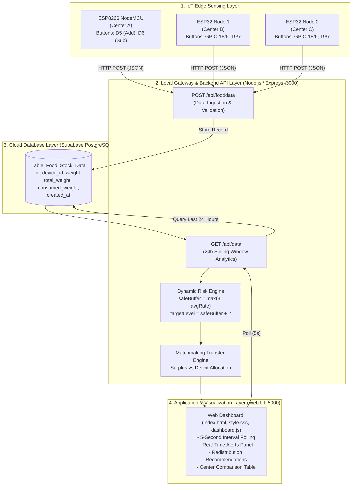

# 🥣 Smart Hunger IoT Monitoring System: Comprehensive Project Overview & Implementation Guide

---

## 1. Executive Summary & Project Purpose

The **Smart Hunger IoT Monitoring System** is an end-to-end IoT and cloud platform engineered to tackle food insecurity, misallocation, and stockouts across decentralized community food distribution centers (e.g., relief centers, food banks, soup kitchens).

### The Problem
Traditional inventory tracking in relief and distribution networks suffers from:
- **Delayed reporting**: Manual stock tallying leads to unexpected stockouts and delayed replenishment.
- **Static threshold limits**: Rigid low-stock thresholds fail to adapt to varying consumption velocities between busy and slow centers.
- **Logistical silos**: A center facing a critical shortage has no real-time visibility into neighboring centers that have surplus stock that could be redistributed before spoiling.

### The Solution
This project implements an autonomous, closed-loop IoT ecosystem that:
1. **Tracks Inventory in Real Time at the Edge**: Deploys microcontrollers (ESP8266 and ESP32) equipped with input switches (and load cell interfaces) to maintain continuous records of daily total stock received, total food distributed/consumed, and live remaining stock.
2. **Predicts Shortage Risks Dynamically**: Utilizes a 24-hour sliding analytics engine that models consumption velocity and historical drop patterns to evaluate hunger risk (`NORMAL`, `MEDIUM RISK`, `HIGH RISK`).
3. **Recommends Intelligent Redistribution Logistics**: Employs an automated matchmaking algorithm that pairs surplus centers with deficit centers, calculating exact transfer weights (in kg) to restore equilibrium across the entire distribution network.
4. **Visualizes Metrics on a Real-Time Dashboard**: Offers a modern, dark-themed responsive web dashboard that polls every 5 seconds, displaying live system alerts, transfer directives, and multi-center comparison tables.

---

## 2. End-to-End System Architecture & Data Flow



### Data Pipeline Walkthrough
1. **Edge Action**: A volunteer presses Button 1 on the microcontroller to log a 10 kg ration delivery, or Button 2 to log a 5 kg food distribution.
2. **Local Calculation & Payload Transmission**: The device computes the net remaining weight (`weight = max(total_weight - consumed_weight, 0)`), packages the state into a JSON payload via `ArduinoJson`, and executes an HTTP POST request to `http://<HOST_IP>:3000/api/fooddata`.
3. **Ingestion & Persistence**: Express receives and validates the payload, then uses `@supabase/supabase-js` to insert an immutable row into the `Food_Stock_Data` PostgreSQL table.
4. **Dashboard Polling & Analytics Query**: The browser client fetches `GET /api/data` every 5 seconds. Express queries all readings from `Food_Stock_Data` within the last 24 hours (`gte created_at, twentyFourHoursAgo`).
5. **Dynamic Analysis**: The backend groups readings by `device_id`, computes recent consumption rates, calculates 24-hour average consumption drops, sets dynamic safety thresholds, assigns risk states, and maps surplus centers to deficit centers.
6. **UI Rendering**: The dashboard renders alert cards, redistribution directives, and an interactive side-by-side metric comparison table.

---

## 3. Hardware & Embedded Firmware Layer

Located in `devices/`, the embedded firmware handles physical inputs, edge tallying, and Wi-Fi data dispatch.

### 3.1 Supported Hardware Platforms
1. **ESP8266 (NodeMCU)**:
   - Primary deployment: `Center A`
   - Firmware source: `devices/esp8266/esp8266_food_sensor.ino`
   - Connectivity: 802.11 b/g/n Wi-Fi using `ESP8266WiFi.h` and `ESP8266HTTPClient.h`
   - Input Pins:
     - Pin `D5` (GPIO 14): Add Stock (+10 kg)
     - Pin `D6` (GPIO 12): Consume Stock (+5 kg simulated)
2. **ESP32 Dev Board**:
   - Primary deployment: Scalable across multiple centers (`Center B`, `Center C`) using the `ESP32_NODE_INDEX` flag
   - Firmware source: `devices/esp32_food_sensor/esp32_food_sensor.ino`
   - Connectivity: Wi-Fi using `WiFi.h` and `HTTPClient.h`
   - Input Pins:
     - Configurable GPIOs with internal pull-up (`INPUT_PULLUP`)
     - Active-LOW switch wiring to Ground

### 3.2 Firmware Mechanics & Logic
- **Active-LOW Debouncing**: Both sketches implement a software debounce window (200 ms) using `millis()` to filter out mechanical switch bounce and prevent duplicate counts.
- **Stock Math on Edge**:
  $$\text{daily\_total\_stock} \leftarrow \text{daily\_total\_stock} + 10.0\text{ (on Add Button)}$$
  $$\text{total\_consumed} \leftarrow \text{total\_consumed} + 5.0\text{ (on Consume Button)}$$
  $$\text{current\_weight} = \max(0, \text{daily\_total\_stock} - \text{total\_consumed})$$
- **Network Resilience**: Sketches continuously verify `WiFi.status() == WL_CONNECTED` and trigger automatic reconnection loops if signal drops.
- **Extensibility for Load Cells**: The firmware includes a modular hook `readSimulatedConsumedWeight()`, specifically designed to be substituted with real-time ADC readings from an **HX711 24-bit ADC amplifier** connected to a strain-gauge load cell.

---

## 4. Backend Gateway & Analytics Engine

Located in `backend/server.js`, built with Node.js, Express, and the Supabase JavaScript Client.

### 4.1 Ingestion Endpoint: `POST /api/fooddata`
- **Request Body**:
  ```json
  {
    "device_id": "Center A",
    "weight": 85.0,
    "total_weight": 100.0,
    "consumed_weight": 15.0
  }
  ```
- **Validation**: Rejects requests lacking `device_id` or `weight` with HTTP 400.
- **Storage**: Inserts into Supabase table `Food_Stock_Data`.

### 4.2 Analytics & Redistribution Endpoint: `GET /api/data`
Fetches all readings created within the last 24 hours (`twentyFourHoursAgo = Date.now() - 86400000`) and groups them by `device_id`.

#### A. Metric Calculations
1. **Recent Consumption Rate**:
   The instantaneous drop between the most recent reading and its immediate predecessor:
   $$\Delta_{\text{recent}} = \max(0, \text{Weight}_{n-1} - \text{Weight}_n)$$
2. **24-Hour Average Consumption**:
   Iterates through all historical readings for the center, identifies every positive drop ($\text{diff} > 0$), and calculates the arithmetic mean:
   $$\text{AvgConsumption} = \frac{\sum \Delta_{\text{drops}}}{N_{\text{drops}}}$$

#### B. Dynamic Hunger Risk Prediction
Instead of rigid static limits, safety buffers adapt dynamically to each center's consumption speed:
$$\text{Safe Buffer} = \max(3.0\text{ kg}, \text{AvgConsumption})$$
$$\text{Target Safe Level} = \text{Safe Buffer} + 2.0\text{ kg}$$

Risk classification rules:
- **`HIGH RISK` (Critical Shortage)**:
  $$\text{Current Weight} \le \text{Safe Buffer}$$
  Triggers immediate warning: *"Critical shortage at [Center]. Current stock: [Weight] kg."*
- **`MEDIUM RISK` (Rapid Depletion)**:
  $$\text{Recent Consumption Rate} > \text{AvgConsumption} \quad \text{AND} \quad \text{Current Weight} \le \text{Target Safe Level}$$
  Triggers warning: *"Rapid consumption detected at [Center]. Risk level elevated."*
- **`NORMAL`**: Stock is stable above safe thresholds.

#### C. Matchmaking Redistribution Algorithm
The engine categorizes centers into two operational buckets:
1. **Deficit Centers**: $\text{Current Weight} < \text{Safe Buffer}$
   $$\text{Needed Stock} = \text{Target Safe Level} - \text{Current Weight}$$
2. **Surplus Centers**: $\text{Current Weight} > \text{Target Safe Level} \quad \text{AND} \quad \text{Risk} == \text{NORMAL}$
   $$\text{Available Stock} = \text{Current Weight} - \text{Target Safe Level}$$

**Greedy Matchmaking Loop**:
```javascript
for (const deficit of deficits) {
    for (const surplus of surpluses) {
        if (surplus.available > 0 && deficit.needed > 0) {
            const amountToMove = Math.min(surplus.available, deficit.needed);
            redistributions.push(`Move ${amountToMove.toFixed(2)} kg from ${surplus.deviceId} to ${deficit.deviceId}`);
            surplus.available -= amountToMove;
            deficit.needed -= amountToMove;
        }
    }
}
```
This produces precise, actionable relocation orders (e.g., *"Move 4.00 kg from Center C to Center A"*).

---

## 5. Cloud Database Layer (Supabase PostgreSQL)

The database layer runs on Supabase (PostgreSQL with built-in REST API and real-time capabilities).

### Database Schema: `public."Food_Stock_Data"`

| Column Name | Data Type | Modifiers / Constraints | Description |
| :--- | :--- | :--- | :--- |
| `id` | `bigint` | Generated by default as identity, PRIMARY KEY | Unique record auto-increment identifier |
| `device_id` | `text` | `NOT NULL` | Distribution center identifier (e.g., "Center A") |
| `weight` | `numeric` | `NOT NULL` | Current remaining stock in kilograms |
| `total_weight` | `numeric` | `DEFAULT 0` | Cumulative stock delivered/added for the day |
| `consumed_weight`| `numeric` | `DEFAULT 0` | Cumulative stock distributed/consumed for the day|
| `created_at` | `timestamptz`| `DEFAULT timezone('utc'::text, now()) NOT NULL` | UTC timestamp of record arrival |

### Schema Migration
Defined in `database/01_add_stock_columns.sql`:
```sql
ALTER TABLE public."Food_Stock_Data"
ADD COLUMN IF NOT EXISTS total_weight NUMERIC DEFAULT 0,
ADD COLUMN IF NOT EXISTS consumed_weight NUMERIC DEFAULT 0;
```

---

## 6. Frontend Web Dashboard

Located in `frontend/`, built purely with vanilla web standards (HTML5, modern CSS3, ES6+ JavaScript) without heavy framework dependencies.

### 6.1 User Interface Architecture
- **Header**: Clean branding with title "Smart Hunger Monitoring Dashboard".
- **Top Split Panels (`top-panels`)**:
  - **⚠️ System Alerts Panel**: Lists all high-priority alerts with red accent borders (`--high-risk: #f43f5e`).
  - **🔄 Redistribution Recommendations Panel**: Outlines exact logistics transfer directives with blue accent indicators (`--accent: #38bdf8`).
- **Full-Width Center Comparison Matrix (`stock-panel`)**:
  - Comparative tabular display presenting all centers side-by-side.
  - Rows:
    1. **Daily Total Stock (kg)**
    2. **Total Consumed (kg)**
    3. **Remaining Stock (kg)** (highlighted in cyan)
    4. **Recent Consumption Rate (kg)**
    5. **Avg Consumption (24h) (kg)**
    6. **Status Badge** (`NORMAL` in emerald green, `MEDIUM RISK` in amber yellow, `HIGH RISK` in rose red).

### 6.2 Polling & Rendering Flow (`dashboard.js`)
- Executes an immediate fetch to `http://localhost:3000/api/data` on boot.
- Re-polls automatically every 5,000 milliseconds (`setInterval(loadData, 5000)`).
- Dynamically alphabetizes centers by `device_id` for stable column layout.
- Gracefully handles empty data states with user-friendly fallback text.

---

## 7. Testing, Simulation & Demo Suite

The repository includes standalone scripts in `backend/` executable via `npm run <script>` to simulate various real-world supply chain scenarios without requiring physical hardware:

| NPM Command | Target Script | Purpose & Scenario |
| :--- | :--- | :--- |
| `npm start` | `backend/server.js` | Launches the core Express backend gateway on port 3000. |
| `npm run seed` | `backend/seed.js` | Direct Supabase insertion of historical data across Centers A, B, and C over a 10-hour span to demonstrate distinct conditions (sudden drop, surplus, shortage). |
| `npm run demo` | `backend/demo_seed.js` | Dispatches sequential multi-step weight reductions via `POST /api/fooddata` to demonstrate real-time risk transitions from Normal to High Risk. |
| `npm run simulate-shortage`| `backend/simulate_shortage_b.js`| Simulates an emergency scenario where Center B drops sharply to 1.5 kg, triggering high-risk alarms. |
| `npm run inject-live` | `backend/inject_live.js` | Simulates an instantaneous state shift: Center A becomes critical (2 kg), Center B stays surplus (12 kg), and Center C receives a refill (14 kg). |
| `npm run apply-redistribution`| `backend/apply_redistribution.js`| Simulates the execution of logistics transfers, re-balancing stocks (Center A: 8 kg, Center B: 10 kg, Center C: 6 kg). |

---

## 8. Complete Codebase File Inventory

Below is an exhaustive inventory of every file in the project workspace:

| Path | Primary Language / Type | Size / Lines | Key Responsibilities & Contents |
| :--- | :--- | :--- | :--- |
| `backend/server.js` | JavaScript (Node.js) | ~6.0 KB / 160 lines | Express API gateway, Supabase connection, `POST /api/fooddata`, `GET /api/data`, dynamic risk engine, matchmaking algorithm. |
| `backend/seed.js` | JavaScript (Node.js) | ~2.0 KB / 48 lines | Directly inserts 10-hour historical profiles into Supabase for Centers A, B, and C. |
| `backend/demo_seed.js` | JavaScript (Node.js) | ~2.6 KB / 65 lines | Posts simulated sequential food consumption steps to the local Express server. |
| `backend/inject_live.js` | JavaScript (Node.js) | ~1.1 KB / 33 lines | Simulates sudden real-time stock shifts across all three centers. |
| `backend/apply_redistribution.js`| JavaScript (Node.js)| ~1.4 KB / 41 lines | Records post-transfer balances after executing redistribution advice. |
| `backend/simulate_shortage_b.js`| JavaScript (Node.js)| ~1.0 KB / 28 lines | Forces Center B into a 1.5 kg critical shortage to verify alarm responsiveness. |
| `backend/.env.example` | Environment Template | 205 bytes | Template defining required `SUPABASE_URL` and `SUPABASE_KEY` variables. |
| `backend/.env` | Environment Config | 114 bytes | Local environment file with active Supabase project credentials. |
| `database/01_add_stock_columns.sql`| SQL (PostgreSQL) | 267 bytes / 7 lines | Migration script to add `total_weight` and `consumed_weight` columns. |
| `devices/esp8266/esp8266_food_sensor.ino`| C++ (Arduino) | ~3.9 KB / 145 lines | Firmware for NodeMCU ESP8266 (`Center A`), debouncing, Wi-Fi HTTP client. |
| `devices/esp8266/README.md` | Markdown | 791 bytes / 28 lines | ESP8266 hardware pinout and flashing documentation. |
| `devices/esp32_food_sensor/esp32_food_sensor.ino`| C++ (Arduino) | ~4.2 KB / 151 lines | Firmware for ESP32 boards (`Center B` and `Center C`), button debounce, HTTP client. |
| `devices/esp32_food_sensor/README.md`| Markdown | ~1.9 KB / 45 lines | ESP32 hardware pinout, node indexing setup, and curl testing instructions. |
| `frontend/index.html` | HTML5 | ~1.1 KB / 37 lines | Semantic HTML structure for the dashboard, panels, and comparison table. |
| `frontend/style.css` | CSS3 | ~3.0 KB / 129 lines | Modern dark theme stylesheet with custom variables, grid layout, and badges. |
| `frontend/dashboard.js` | JavaScript (ES6) | ~3.3 KB / 92 lines | 5-second polling loop, metric rendering, and dynamic alert styling. |
| `package.json` | JSON | 715 bytes / 27 lines | NPM package definitions, scripts (`start`, `seed`, `demo`, etc.), and dependencies. |
| `package-lock.json` | JSON | ~35.7 KB | Exact lockfile for Node dependencies (`express`, `@supabase/supabase-js`, etc.). |
| `README.md` | Markdown | ~8.5 KB / 198 lines | Primary repository documentation with architecture diagram and setup guide. |
| `DOCUMENTATION.md` | Markdown | ~2.4 KB / 62 lines | Operational quick reference detailing data flow, payloads, and pin maps. |
| `project_report.txt` | Plain Text | ~14.6 KB / 295 lines | Detailed academic project report with hardware specifications and performance observations. |
| `Software_Requirements_Smart_Hunger_System.docx`| Word Document | ~24.6 KB | Formal Software Requirements Specification (SRS) document outlining project requirements. |

---

## 9. Current Operational Status & Observations

1. **Working End-to-End**:
   - Firmware compiles and connects over local Wi-Fi.
   - REST API successfully validates and saves edge data in cloud Supabase PostgreSQL.
   - 24-hour analytics calculation computes dynamically without hardcoded static thresholds.
   - Frontend updates automatically every 5 seconds via REST polling.
2. **Simulation Completeness**:
   - The test scripts cover all major operational states: steady consumption, sudden depletion, critical stockout, and post-transfer recovery.
3. **Firmware Consistency Note**:
   - In `devices/esp32_food_sensor/esp32_food_sensor.ino`, lines 18–22 currently check `#if ESP32_NODE_INDEX == 1` and map to `"Center A"`, whereas `README.md` specifies that ESP8266 is dedicated to `"Center A"`, and ESP32 nodes should be indexed for `"Center B"` and `"Center C"`. When flashing two physical ESP32 boards alongside an ESP8266, this macro should map `1 -> Center B` and `2 -> Center C`.
   - The ESP32 code uses GPIO 6 and 7 as button pins, whereas the README references GPIO 18 and 19. Pins should be aligned according to the specific ESP32 board variant used.

---

## 10. Future Roadmap & Enhancement Opportunities

Based on the Software Requirements Specification (SRS) and project roadmap:
1. **Physical Load Cell Sensor (HX711)**:
   - Connect 4-wire strain-gauge load cells through the HX711 24-bit ADC module to replace the 5 kg simulation button with physical continuous weight measurement.
2. **Push Notifications & Automated Dispatch**:
   - Integrate WebSockets or Server-Sent Events (SSE) instead of 5-second HTTP polling.
   - Add Twilio SMS or SendGrid Email alerts for center managers when a `HIGH RISK` condition is detected.
3. **Machine Learning Demand Forecasting**:
   - Train time-series models (e.g., ARIMA, Prophet, or LSTM) on historical 24-hour consumption curves to anticipate stockouts hours in advance based on day-of-week and time-of-day demand patterns.
4. **Geographic & Route Optimization**:
   - Integrate latitude/longitude coordinates for distribution centers and use distance/routing algorithms (e.g., Google Maps API or Dijkstra) to match surplus centers with the nearest deficit center to minimize transportation time and fuel costs.
