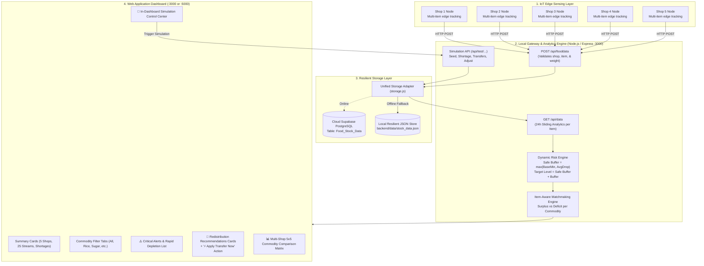

# 🥣 Smart Hunger IoT Monitoring System: Multi-Commodity Distribution & Autonomous Redistribution Architecture

---

## 1. Executive Summary & Problem Solved

The **Smart Hunger IoT Monitoring System** is an end-to-end IoT, cloud, and edge analytics platform designed to solve food misallocation, sudden stockouts, and delayed reporting across decentralized community food distribution networks (ration shops, food banks, relief depots, and soup kitchens).

### Core Features Implemented
1. **5 Essential Food Commodities per Shop**:
   - 🍚 **Rice** (kg)
   - 🍬 **Sugar** (kg)
   - 🌾 **Wheat** (kg)
   - 🥣 **Toor Dal** (kg)
   - 🛢️ **Palm Oil** (Liters)
2. **5 Monitored Distribution Shops**:
   - `Shop 1 (Central Hub)`
   - `Shop 2 (North Market)`
   - `Shop 3 (South Depot)`
   - `Shop 4 (East District)`
   - `Shop 5 (West Center)`
3. **Item-Aware Dynamic Hunger Risk Prediction**:
   - Evaluates consumption velocity and historical drop patterns per commodity item.
   - Dynamic safety thresholds adjust to each shop's specific consumption rate:
     $$\text{Safe Buffer}_{\text{item}} = \max(\text{BaseMin}_{\text{item}}, \text{AvgConsumptionRate}_{\text{item}})$$
     $$\text{Target Safe Level}_{\text{item}} = \text{Safe Buffer}_{\text{item}} + \text{TargetBuffer}_{\text{item}}$$
   - Classifies stock into `NORMAL`, `MEDIUM RISK` (rapid depletion), and `HIGH RISK` (critical shortage).
4. **Intelligent Item-Aware Redistribution Engine**:
   - Evaluates surpluses and deficits strictly by matching commodity: surplus Rice only satisfies deficit Rice; surplus Palm Oil only satisfies deficit Palm Oil.
   - Computes exact transfer quantities and outputs point-to-point transfer directives (Source Shop $\rightarrow$ Target Shop, Amount, Post-transfer safe balances).
5. **Interactive In-Dashboard Simulation & Testing Suite**:
   - 1-click test actions directly in the browser: Seed 5 Shops Baseline, Inject Emergency Shortages, Execute Recommended Transfers, Reset All Data, and Custom Manual Stock Injection.
6. **Resilient Dual Storage**:
   - Cloud Supabase PostgreSQL persistence with automatic, zero-config fallback to local resilient JSON database (`backend/data/stock_data.json`) when cloud instances are paused or offline.

---

## 2. System Architecture & Data Flow



---

## 3. Commodity Specifications & Dynamic Thresholds

Each commodity has specific baseline parameters configured in `backend/server.js`:

| Commodity | Measurement Unit | Base Minimum Threshold | Target Buffer | Typical Stock Target |
| :--- | :---: | :---: | :---: | :---: |
| **Rice** 🍚 | kg | 10.0 kg | +5.0 kg | 15.0 kg |
| **Sugar** 🍬 | kg | 5.0 kg | +3.0 kg | 8.0 kg |
| **Wheat** 🌾 | kg | 8.0 kg | +4.0 kg | 12.0 kg |
| **Toor Dal** 🥣 | kg | 5.0 kg | +3.0 kg | 8.0 kg |
| **Palm Oil** 🛢️ | Liters | 5.0 L | +3.0 L | 8.0 L |

### Mathematical Formulations
1. **Recent Consumption Rate** ($\Delta_{\text{recent}}$):
   $$\Delta_{\text{recent}} = \max(0, \text{Weight}_{t-1} - \text{Weight}_t)$$
2. **24-Hour Average Consumption** ($\text{AvgDrop}$):
   $$\text{AvgDrop} = \frac{\sum_{i=1}^{n} \max(0, W_{i-1} - W_i)}{n_{\text{drops}}}$$
3. **Dynamic Safe Buffer**:
   $$\text{Safe Buffer} = \max(\text{BaseMin}, \text{AvgDrop})$$
4. **Target Safe Level**:
   $$\text{Target Safe Level} = \text{Safe Buffer} + \text{TargetBuffer}$$

### Risk Rules
- **`HIGH RISK` (Critical Shortage)**:
  $$\text{Current Weight} \le \text{Safe Buffer}$$
- **`MEDIUM RISK` (Rapid Depletion)**:
  $$\Delta_{\text{recent}} > \text{AvgDrop} \quad \text{AND} \quad \text{Current Weight} \le \text{Target Safe Level}$$
- **`NORMAL`**:
  $$\text{Current Weight} > \text{Target Safe Level}$$

---

## 4. Intelligent Item-Aware Redistribution Algorithm

Traditional systems either rely on static manual intervention or treat all weight interchangeably. The Smart Hunger Redistribution Engine ensures **commodity integrity**:

```
For Each Commodity C in [Rice, Sugar, Wheat, Toor Dal, Palm Oil]:
  1. Identify Deficit Shops where CurrentWeight < SafeBuffer:
       NeededAmount = TargetSafeLevel - CurrentWeight
  2. Identify Surplus Shops where CurrentWeight > TargetSafeLevel and Risk == NORMAL:
       AvailableAmount = CurrentWeight - TargetSafeLevel
  3. Sort Deficits descending by Need (most severe first)
  4. Sort Surpluses descending by Available (largest reserve first)
  5. Greedily Match and Allocate:
       TransferAmount = min(AvailableAmount, NeededAmount)
       Generate Directive: Move TransferAmount of Commodity C from SourceShop to TargetShop
```

Every directive guarantees that:
- The **Source Shop** retains at least its `Target Safe Level` (never creating a new deficit).
- The **Target Shop** is brought up to its `Target Safe Level`.

---

## 5. REST API Specifications

### Ingestion: `POST /api/fooddata`
- **Request Body**:
  ```json
  {
    "device_id": "Shop 1 (Central Hub)",
    "item_name": "Rice",
    "weight": 85.0,
    "total_weight": 120.0,
    "consumed_weight": 35.0
  }
  ```
- **Batch Support**: Accepts JSON arrays of items.
- **Backward Compatibility**: If `item_name` is omitted, defaults to `"Rice"`.

### Analytics: `GET /api/data`
Returns aggregated metrics for all 5 shops $\times$ 5 items:
```json
{
  "shops": [
    {
      "shop_id": "Shop 1 (Central Hub)",
      "items": [
        {
          "item_name": "Rice",
          "unit": "kg",
          "current_weight": 85.0,
          "total_weight": 120.0,
          "consumed_weight": 35.0,
          "consumption_rate": "0.00",
          "avg_consumption": "3.50",
          "safe_buffer": 10.0,
          "target_level": 15.0,
          "risk_level": "NORMAL"
        },
        ...
      ]
    }
  ],
  "commodities": ["Rice", "Sugar", "Wheat", "Toor Dal", "Palm Oil"],
  "summary": {
    "total_shops": 5,
    "total_inventory_lines": 25,
    "high_risk_count": 5,
    "medium_risk_count": 0,
    "normal_count": 20,
    "active_transfers_count": 5
  },
  "alerts": [...],
  "redistributions": [...]
}
```

### Simulation & Testing Endpoints
- `POST /api/test/seed`: Injects 100 historical readings (4 steps $\times$ 25 streams) modeling realistic 24-hour demand.
- `POST /api/test/shortage`: Drops specific items across multiple shops to emergency levels.
- `POST /api/test/apply-transfer`: Applies recommended transfers into active inventory.
- `POST /api/test/adjust`: Injects a single custom reading (`{ device_id, item_name, weight }`).
- `POST /api/test/reset`: Clears all readings for a clean slate.

---

## 6. Testing & Simulation Verification Guide

### Method 1: In-Dashboard Interactive Testing (Recommended)
1. Start the server:
   ```bash
   npm start
   ```
2. Open `http://localhost:3000` in your web browser.
3. Use the **🧪 Simulation & Testing Control Center** at the top of the page:
   - Click **"🌱 Seed 5 Shops Baseline"**: Loads the 5-shop, 25-stream inventory.
   - Click **"🚨 Simulate Emergency Shortages"**: Instantly drops Shop 3 Rice & Toor Dal, Shop 4 Sugar, and Shop 5 Wheat & Palm Oil. Observe the red alerts and transfer recommendations appear automatically.
   - Click **"⚡ Apply Transfer Now"** on any card or **"🚚 Execute All Transfers"**: Applies the stock transfers and watches the deficit items transition back to `NORMAL`.
   - Use **"Quick Manual Stock Injection"**: Select any shop, commodity, and weight to test custom scenarios.

### Method 2: Command-Line Simulation Scripts
- **Seed Baseline**:
  ```bash
  npm run seed
  # or: npm run seed-5shops
  ```
- **Simulate Critical Shortage**:
  ```bash
  npm run simulate-shortage
  ```
- **Apply Redistribution Transfers**:
  ```bash
  npm run apply-redistribution
  ```

---

## 7. File Inventory

| Path | Language / Type | Description |
| :--- | :--- | :--- |
| `backend/server.js` | JavaScript (Node.js) | Core gateway API, 5-commodity analytics, item-aware matchmaking algorithm, simulation endpoints. |
| `backend/storage.js` | JavaScript (Node.js) | Resilient dual-storage adapter (Supabase PostgreSQL + local JSON fallback). |
| `backend/seed_5shops.js` | JavaScript (Node.js) | Standalone script to seed 24-hour baseline curves for 5 shops $\times$ 5 items. |
| `backend/simulate_5shops_shortage.js` | JavaScript (Node.js) | Standalone script to inject emergency shortage spikes. |
| `backend/apply_redistribution.js` | JavaScript (Node.js) | Standalone script to apply redistribution logistics. |
| `database/01_add_stock_columns.sql` | SQL | Adds `total_weight` and `consumed_weight` columns. |
| `database/02_add_item_support.sql` | SQL | Adds `item_name` column and index for commodity tracking. |
| `frontend/index.html` | HTML5 | Executive metrics, simulation control panel, alerts, redistribution cards, multi-item matrix. |
| `frontend/style.css` | CSS3 | Responsive dark theme, commodity chips, progress bars, interactive buttons. |
| `frontend/dashboard.js` | JavaScript (ES6) | Real-time 5s polling, item tab filter, simulation button triggers, dynamic rendering. |
| `package.json` | JSON | Project dependencies and simulation scripts. |
| `COMPREHENSIVE_PROJECT_OVERVIEW.md` | Markdown | This master architecture and implementation guide. |
| `README.md` | Markdown | GitHub front-page documentation. |
| `DOCUMENTATION.md` | Markdown | Hardware and operational quick-reference notes. |
