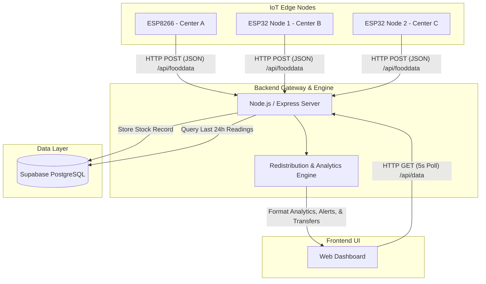

# 🥣 Smart Hunger IoT Monitoring System

An end-to-end IoT-driven inventory management and resource redistribution system. This platform dynamically monitors food stock levels at multiple distribution centers, predicts hunger shortage risks in real-time, and recommends redistribution logisitics to optimize food supply chains.

---

## 🚀 Key Features

*   **IoT Edge Tracking**: Integrates ESP8266 and ESP32 nodes with simulated or actual physical weight inputs to monitor stocks.
*   **Dynamic Shortage Risk Prediction**: Shifts away from fixed thresholds, instead calculating risk levels (`NORMAL`, `MEDIUM RISK`, `HIGH RISK`) based on 24-hour sliding averages of consumption rates.
*   **Intelligent Resource Redistribution**: Employs a matchmaking algorithm to balance supply by transferring surplus stocks from stable centers directly to deficit centers.
*   **Interactive Web Dashboard**: Modern dark-themed dashboard presenting live status tables, alert rosters, and automated redistribution recommendations.

---

## 📐 System Architecture

The following diagram illustrates the flow of data from the IoT microcontrollers at the edge, through the Express gateway, into the Supabase database, and finally served to the web dashboard.



---

## 📁 Repository Structure

```text
smart-hunger-iot/
├── backend/
│   ├── .env.example             # Template for API credentials
│   ├── apply_redistribution.js  # Script to simulate redistribution execution
│   ├── demo_seed.js             # Script to inject mock multi-step demo data
│   ├── inject_live.js           # Script to simulate real-time weight drops
│   ├── seed.js                  # Script to seed database with base profiles
│   ├── server.js                # Express backend application gateway
│   └── simulate_shortage_b.js   # Script to trigger a critical shortage alarm
├── database/
│   └── 01_add_stock_columns.sql # SQL migration query to update schema
├── devices/
│   ├── esp32_food_sensor/
│   │   ├── esp32_food_sensor.ino # Firmware for ESP32 nodes (Center B & C)
│   │   └── README.md             # ESP32 specific wiring & setup docs
│   └── esp8266/
│       ├── esp8266_food_sensor.ino # Firmware for ESP8266 node (Center A)
│       └── README.md             # ESP8266 specific wiring & setup docs
├── frontend/
│   ├── dashboard.js             # Core frontend polling and rendering logic
│   ├── index.html               # Main dashboard UI structure
│   └── style.css                # Premium modern dark-theme dashboard styles
├── package.json                 # Node dependencies and execution scripts
├── DOCUMENTATION.md             # Supplemental cleanup & system notes
└── project_report.txt           # Extensive hardware/performance analysis report
```

---

## 🔌 Hardware Setup & Wiring

### 1. ESP8266 Node (`Center A`)
*   **Hardware**: ESP8266 NodeMCU.
*   **Pins**:
    *   `D5` -> Push Button (Add Stock, +10 kg)
    *   `D6` -> Push Button (Consume Stock, +5 kg)
*   **Wiring**: Active-LOW layout. Connect buttons to the designated digital pins and `GND`. Built-in internal pull-up (`INPUT_PULLUP`) is configured in code.

### 2. ESP32 Nodes (`Center B` and `Center C`)
*   **Hardware**: ESP32 Development Board.
*   **Node Index Configuration**: Adjust `ESP32_NODE_INDEX` in the firmware header:
    *   `1` -> **Center B**
    *   `2` -> **Center C**
*   **Pins**:
    *   `GPIO 18` -> Push Button (Add Stock, +10 kg)
    *   `GPIO 19` -> Push Button (Consume Stock, +5 kg)
*   **Wiring**: Active-LOW layout. Connect buttons to the designated GPIO pins and `GND`.

---

## 💾 Database Setup (Supabase)

The system stores logs in a Supabase PostgreSQL database under the table name `Food_Stock_Data`.

1. **Table Schema**: Create the table in your Supabase SQL Editor with the following structure:
    ```sql
    CREATE TABLE public."Food_Stock_Data" (
        id bigint GENERATED BY DEFAULT AS IDENTITY PRIMARY KEY,
        device_id text NOT NULL,
        weight numeric NOT NULL,
        total_weight numeric DEFAULT 0,
        consumed_weight numeric DEFAULT 0,
        created_at timestamp with time zone DEFAULT timezone('utc'::text, now()) NOT NULL
    );
    ```
2. **Database Migration**: Run the migration query located in [01_add_stock_columns.sql](file:///d:/VSC/smart-hunger-iot/database/01_add_stock_columns.sql) to add the weight tracking column support.

---

## ⚙️ Software Setup & Execution

### 1. Backend Gateway Installation
Navigate to the root directory, install the required packages, and copy the environment template:
```bash
# Install dependencies
npm install

# Set up local environment credentials
cp backend/.env.example backend/.env
```
Open `backend/.env` and replace the placeholder values with your live Supabase credentials:
```env
SUPABASE_URL=https://your-project-id.supabase.co
SUPABASE_KEY=your-supabase-anon-or-service-role-key
```

### 2. Run the Server
Launch the Express gateway server:
```bash
npm start
```
The server will boot and listen for incoming HTTP posts from IoT devices and dashboard fetch requests at `http://localhost:3000`.

### 3. Open the Frontend Dashboard
To run the dashboard, you can open `frontend/index.html` directly in a browser, or run a local web server from the project directory:
```bash
npx serve frontend
```
The dashboard is configured to poll `http://localhost:3000/api/data` every 5 seconds to draw live comparison tables, highlight active risk alerts, and display calculated transfers.

---

## 🧪 Simulation and Seeding

To verify dashboard visuals and data algorithms without physical microcontrollers, use the built-in NPM simulation scripts:

*   **Seed Standard State**: Populates base history for Centers A, B, and C to establish normal and warning thresholds.
    ```bash
    npm run seed
    ```
*   **Seed Demo Walkthrough**: Posts sequential weight drops through the active local backend to show dynamic risk escalation.
    ```bash
    npm run demo
    ```
*   **Trigger Shortage Alert**: Drop Center B to critical levels (1.5 kg) to confirm `HIGH RISK` notifications.
    ```bash
    npm run simulate-shortage
    ```
*   **Execute Redistribution Logisitics**: Simulates the physical transfer of food stock, updating database tallies to bring Center A back to a safe level.
    ```bash
    npm run apply-redistribution
    ```

---

## 📊 Analytics & Redistribution Logic

### Hunger Risk Prediction
Rather than static alert levels, safety thresholds are calculated dynamically:
$$\text{Safe Buffer} = \max(3\text{ kg}, \text{Average 24h Consumption Rate})$$
$$\text{Target Safe Level} = \text{Safe Buffer} + 2\text{ kg}$$

*   **HIGH RISK**: Current stock weight is $\le$ Safe Buffer.
*   **MEDIUM RISK**: Stock is consumed at a rate exceeding the 24h average while remaining stock is $\le$ Target Safe Level.

### Matchmaking Transfers
Deficits and surpluses are sorted dynamically:
1.  **Deficits**: Centers with current stock $<$ Safe Buffer. The shortage quantity needed is computed as: $\text{needed} = \text{Target Safe Level} - \text{current\_weight}$.
2.  **Surpluses**: Centers with current stock $>$ Target Safe Level and having `NORMAL` risk. The available transfer stock is: $\text{available} = \text{current\_weight} - \text{Target Safe Level}$.
3.  **Redistribution**: Matches surplus nodes with deficit nodes sequentially, printing exact kg transfer directives.
